## Cobalt Strike - Valid SSL Certificate to Code Signing

<br>

#### Documentation references, see at: 

* https://hstechdocs.helpsystems.com/manuals/cobaltstrike/current/userguide/content/topics/malleable-c2_code-signing-certificate.htm#_Toc65482849
* https://hstechdocs.helpsystems.com/manuals/cobaltstrike/current/userguide/content/topics/malleable-c2_valid-ssl-certificates.htm#_Toc65482847

<br>

### Step 1

<br>

#### Generate an valid certificate with Let`s Encrypt.

<br>

#### Certbot Command for Apache2: 

<br>

``` 
certbot -n --apache -d updates.losenolove.com --agree-tos --email myaccount@mail --no-eff-email --hsts --redirect
```

<br>

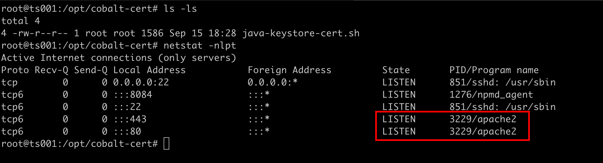

<br>


#### Run certbot command to generate Let`s Encrypt certificate keys.

<br>

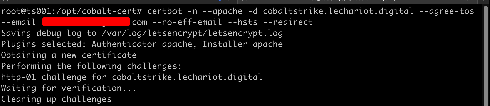

<br>

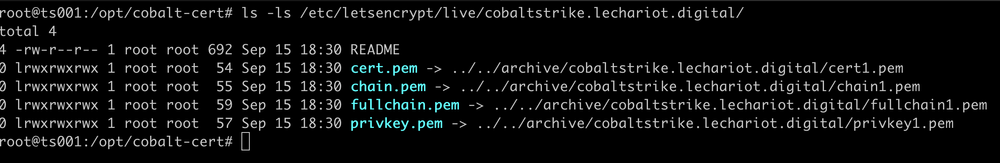

<br>

### Step 2

<br>

#### Configure the Shell Script java-keystore-cert.sh with informations about domain and password and run script to generate certificates in current path directory.

<br>

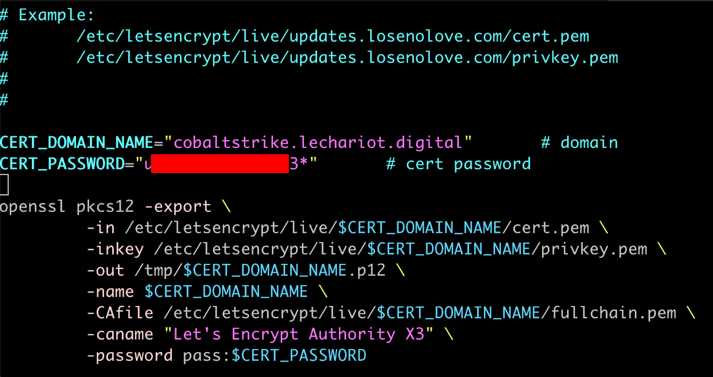

<br>

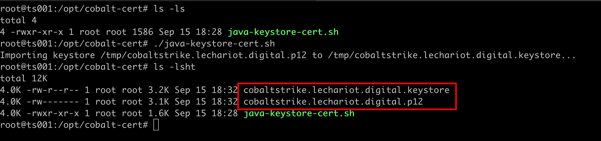

<br>

### Step 3 

<br>

#### To use certificates in Malleable C2 Profiles, the files need stay in current.

<br>

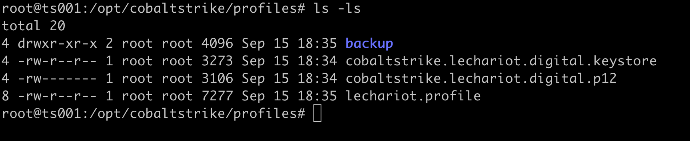

<br>

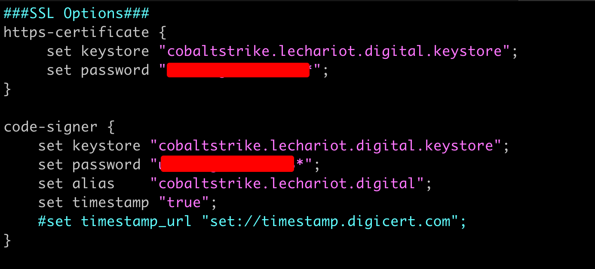

<br>

#### Use C2lint script to check configurations in profile.

<br>

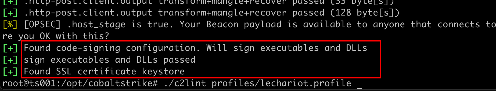

<br>

### Step 4

<br>

#### Just test.

<br>

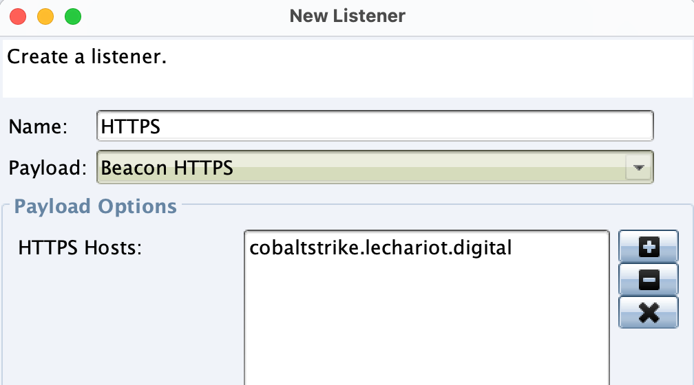

<br>

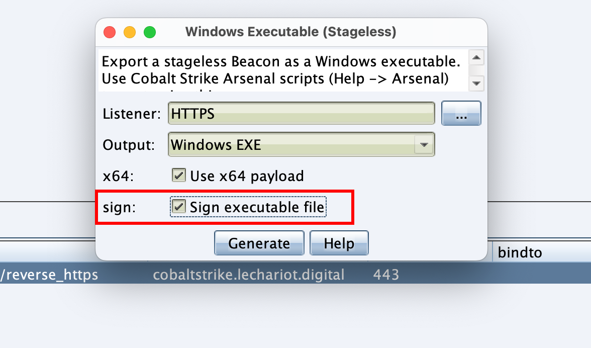

<br>

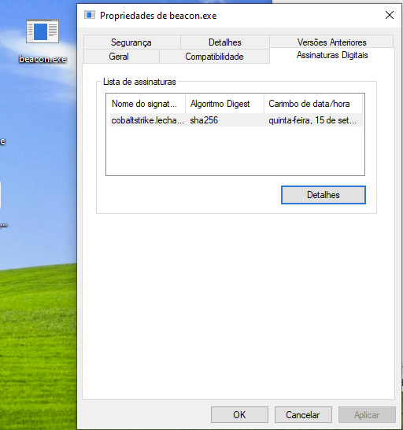

<br>

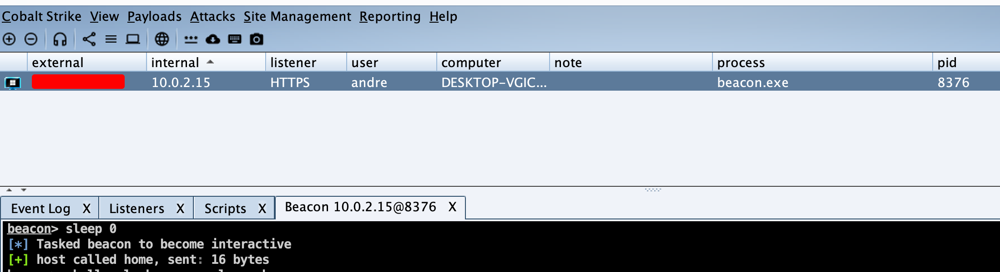


